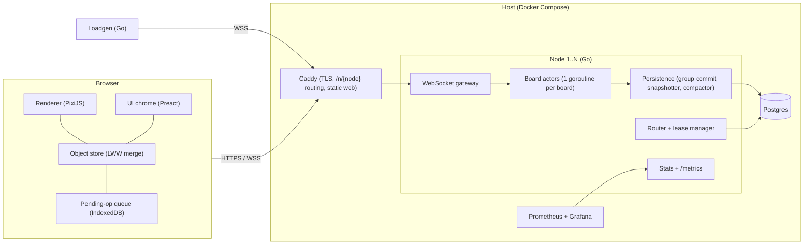
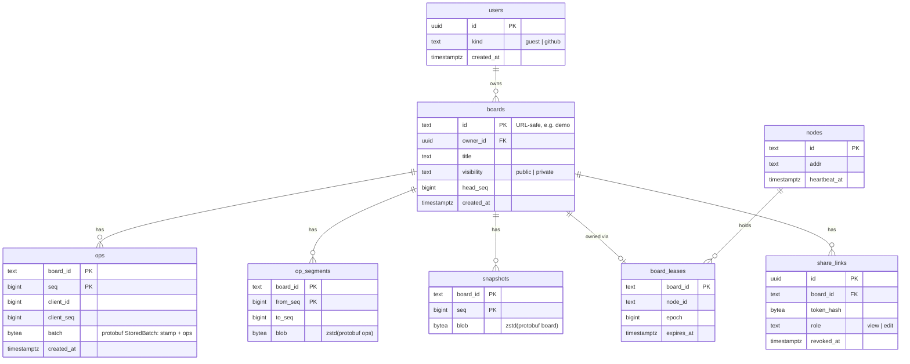
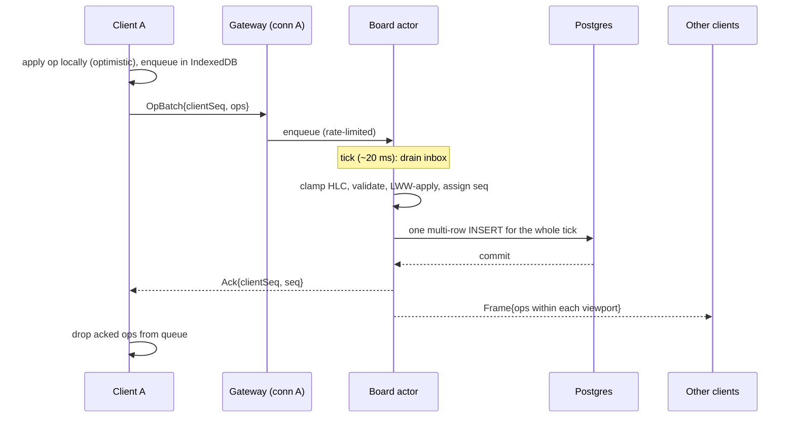
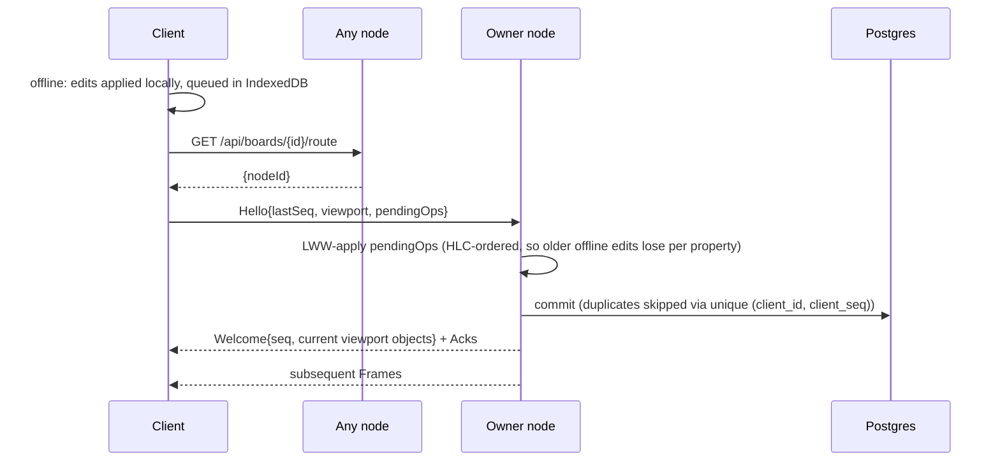
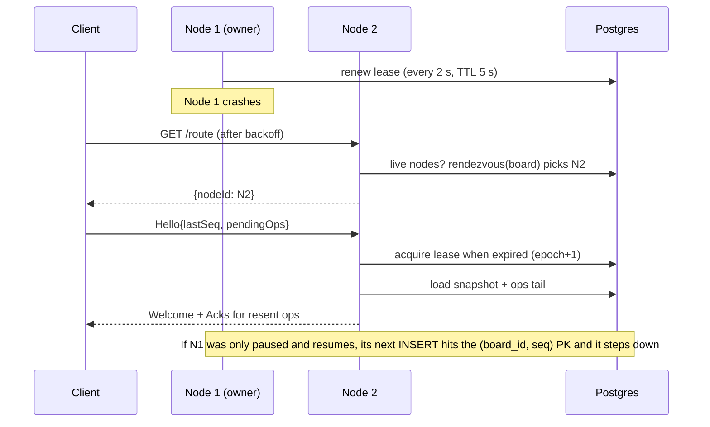

# Architecture

This doc describes the design; every number in it is a design parameter or a target, not a measured result. Decisions and trade-offs are recorded in [decisions/](decisions/).

## 1. Components

| Component | Responsibility |
|---|---|
| Renderer | Draws the objects in the client's cache. Hit-testing. Switches to level-of-detail (LOD) mode when zoomed out. |
| Object store | The client's copy of the objects in its viewport. Applies local ops optimistically and merges remote ops with LWW. |
| Pending-op queue | Ops the server hasn't acknowledged, persisted in IndexedDB so they survive reloads and offline periods. |
| WebSocket gateway | Handshake and auth. One reader and one writer goroutine per connection. Bounded send queues. |
| Router and lease manager | Node heartbeats. Rendezvous placement. Acquiring and renewing board leases. The `/route` API. |
| Board actor | The single writer for one board. Keeps objects and a spatial grid in memory. Assigns `seq`. Runs the tick loop. |
| Persistence | Group commit per tick. Snapshots every 5k ops or 10 minutes. Compacts ops into segments. |
| Stats | Prometheus metrics, plus a public stats stream for the live metrics panel. |
| Loadgen | Simulated editors that speak the real protocol. Records latency histograms. |

## 2. Data model

### Board object
| Field | Type | Notes |
|---|---|---|
| `id` | string | Generated by the client: `{clientId in base 36}:{counter in base 36}`. The server only accepts creates under the sender's own prefix. |
| `type` | enum | rect, ellipse, sticky, text, arrow, freehand. Set once, at create. |
| `deleted` | bool | Deleting sets it to true; restoring sets it back to false. |
| `x, y, w, h` | double | Bounding box in board coordinates. The spatial index uses it. |
| `z` | string | Fractional index. |
| `fill`, `stroke`, `strokeWidth` | uint32 RGBA, float | Style. |
| `text` | string | Text of stickies and text shapes. LWW on the whole string. |
| `points` | bytes | Freehand points, delta-encoded (W3). |
| `from`, `to` | {objectId, anchor} | Arrow bindings (W3). |

Each property is a last-writer-wins register with its own stamp `(wallMs, counter, clientId)`. The schema is `ObjectProps` in [proto/whiteboard/v1/protocol.proto](../proto/whiteboard/v1/protocol.proto).

### Operations
There is one op: `Op{id, props}`, meaning "set every property present in `props`". Create, edit, delete, and restore are all this op:
- **Create:** an op on an unknown id that sets `type`.
- **Delete:** sets `deleted = true`. A concurrent edit to other properties can't bring the object back, and history or undo restores it with a newer `deleted = false`.

A client sends ops in an **OpBatch**. All ops in a batch share one stamp and are applied atomically. A multi-select drag is one batch.

### Postgres schema (v1)

Timers and votes are stored as ops in the same log, with their own op types, so replay includes them.

### Wire protocol (Protobuf over binary WebSocket frames)

The schema is [proto/whiteboard/v1/protocol.proto](../proto/whiteboard/v1/protocol.proto). "Since" marks the milestone that adds each message.

| Direction | Message | Purpose | Since |
|---|---|---|---|
| Client → server | `Hello{boardId, clientId}` | Join or rejoin a board. The token and viewport come later. | W0/W1 |
| Client → server | `OpBatch{clientSeq, stamp, ops}` | Send edits. | W1 |
| Client → server | `TimePing{t0}` | RTT and clock-offset estimation. | W0 |
| Client → server | `Viewport{rect, lod}` | Change the region the client is watching. | W4 |
| Client → server | `Cursor{x, y}` | Presence. | W3 |
| Client → server | `HistoryAt{seq}` | Request board state at a point in history. | W5 |
| Server → client | `Welcome{seq, objects, lastClientSeq, serverTime}` | Snapshot for (re)joining. `lastClientSeq` tells a reconnecting client which pending batches the server already applied. | W1 |
| Server → client | `Frame{batches[], acks[]}` | Per-tick delivery: other clients' batches in seq order, plus acks for this client's own. An ack carries the stamp the batch was applied with, or `rejected`. | W1 |
| Server → client | `TimePong{t0, serverTime}` | Clock-offset reply. | W0 |
| Server → client | `ServerError{code, message}` | Sent before closing; codes that retrying can't fix (`UNSUPPORTED_VERSION`, `BAD_REQUEST`, `CLIENT_ID_IN_USE`) stop reconnection. | W0/W1 |
| Server → client | `ViewportDiff{enter[], leave[]}` | Objects entering or leaving the client's region. | W4 |
| Server → client | `Moved{nodeId}` | Wrong node; the client should re-route. | W8 |

## 3. Data flows

### 3.1 Edit path

- **Encode once (W4):** each op will be serialized once per tick, and a client's frame will be the concatenation of the pre-encoded ops it is interested in. In W1, each client's frame is marshaled separately; that is the baseline to measure the optimization against.
- **Backpressure:** each connection has a bounded send queue (256 messages). A client that overflows it is closed with WebSocket code 1013 ("try again later"). It then reconnects and gets a fresh snapshot, so one slow client never stalls the board. Incoming traffic is throttled differently: a client whose batches fill the board's inbox is blocked on its own socket, not dropped.
- **Commit before broadcast:** each tick, the board appends that tick's batches with one `COPY`, then sends acks and frames. An edit becomes visible to others only after it is durable.
- **Crash-only failure:** if a commit fails, the board kicks every client (close code 1013) and unloads. Uncommitted batches were never acked, so their clients resend them to the reloaded board.
- **Load and snapshots:** a board loads from its latest snapshot plus the log after it. That rebuilds objects, `seq`, each client's last `clientSeq`, and the HLC. Snapshots are written every 5,000 batches (in the background, from a copy), when an idle board unloads, and on shutdown.
- **Tests:** [internal/client/client_test.go](../internal/client/client_test.go) crashes boards repeatedly during randomized editing, and [test/e2e/kill_test.go](../test/e2e/kill_test.go) SIGKILLs the real node mid-edit. Both check that every acked batch is in the log and that all replicas converge.
- **Stamp clamping:** a stamp more than 2 s ahead of server time is replaced with the server's clock. The ack carries the replacement, and the client resyncs, because its local replica holds values under a stamp nobody else has.
- **Duplicates and gaps:** the board tracks the last `clientSeq` per client. A resend of an applied batch is acked again but not reapplied. A gap is rejected.
- **Newest connection wins:** a reconnecting client often arrives before the server notices its previous socket died, since half-open TCP connections can linger for minutes. So a join with an existing client id replaces the old connection. The old one gets `CLIENT_ID_IN_USE` and does not reconnect, so two tabs sharing an id can't keep evicting each other.
- **Convergence tests:** [internal/client/client_test.go](../internal/client/client_test.go) drives real sockets with random edits, drops, and offline periods. [web/src/sync/session.test.ts](../web/src/sync/session.test.ts) property-tests the browser session against a model server.

### 3.2 Viewport interest (spatial filtering)
- **Server index:** the board actor keeps a uniform grid of 512×512-unit cells mapping each cell to object ids. Updates are O(cells covered), and moves are frequent.
- **Subscriptions:** each client subscribes to its viewport rectangle plus a 50% margin.
- **Per op:** the server tests the object's old and new bounding boxes against each client's rectangle.
  - **Enters the view** (new box intersects, old box didn't): send the full object.
  - **Inside the view** (both boxes intersect): send the delta.
  - **Leaves the view** (old box intersects, new box doesn't): send the delta; the client evicts the object.
- **No per-client object sets:** thanks to these rules, the server doesn't track which objects each client holds, only each client's rectangle.
- **Viewport change:** the server queries the grid for the new rectangle minus the old one and sends a `ViewportDiff`.
- **LOD mode:** used below a zoom threshold. The server sends `{id, bbox, fill}` only, and the client draws plain rectangles.

### 3.3 Presence (live cursors)
- **Ephemeral:** cursors are never persisted or sequenced.
- **Client side:** each client sends at most 15 Hz, with coordinates quantized to integers.
- **Server side:** per tick, the actor keeps only the latest cursor per user. Each client gets the **K = 30 nearest** cursors within its viewport, plus `othersCount` for the rest.
- **Wire size:** cursors are sent only if they moved since the last frame, encoded compactly (ids as small integers, positions as int32).

### 3.4 Reconnect and offline

- **Clock clamp:** HLC values ahead of server time by more than the allowed skew are clamped, so an offline client with a wrong clock can't overwrite newer work.
- **Bounded queue:** the offline queue is capped at 10k ops or 5 MB. Beyond that, the client shows a warning.

### 3.5 History replay and point-in-time restore
- **State at `seq = s`:** load the nearest snapshot at or before `s`, then replay segments and ops up to `s`.
  - The actor for live editing is not involved; a separate history worker does this.
  - Reconstructed states are cached as keyframes, every 1,000 ops, in an LRU.
- **Replay slider:** sends `HistoryAt{seq}`, debounced. The response is filtered to the viewport. A play button streams ops at 10× to 100× speed.
- **Restore to `s`:** the server diffs the current state against the state at `s` and appends the difference as a normal `OpBatch`: property sets, including `deleted = false` for objects deleted since `s` and `deleted = true` for objects created since. History stays append-only, and a restore can be undone.

### 3.6 Placement and failover

### 3.7 Synchronized timers
- **State:** the server holds `{endsAtServerMs | pausedRemainingMs, duration}` and records each change as an op.
- **Clock offset:** on join, the client sends 8 `TimePing` messages and keeps the one with the lowest round-trip time (RTT):
  - `offset = tServer + rtt/2 − t_recv`
  - It re-estimates every 60 s.
- **Display:** `remaining = endsAtServerMs − (Date.now() + offset)`, updated every animation frame.
- **Measured quality:** timer skew is measured in BENCHMARKS.md.

### 3.8 Voting
- **Session:** the board owner starts a session: `{sessionId, votesPerUser, anonymous, endsAt}`.
- **Casting:** votes are ops of the form `Vote{sessionId, objectId, delta}`.
- **Results:** tallies are hidden until the session ends or the owner reveals them.

### 3.9 Auth, permissions, abuse
- **Guest identity:** on first visit the server issues a signed guest token (HMAC), stored in localStorage. No signup.
- **Roles:** owner, editor, or viewer.
  - Owner: the board's creator.
  - Editor or viewer: granted by a **share link**.
- **Share links:**
  - Format: `/b/{boardId}#k={token}`. The token is in the URL fragment, so it never appears in server logs or Referer headers.
  - The server stores only a hash of the token. The owner can revoke a link.
- **Visibility:** a public board is readable by anyone with its id. The demo board is public and editable.
- **Rate limits (token buckets):**
  - Per connection: ops/s, bytes/s, cursor Hz.
  - Per IP: connections, board creations per hour.
  - Per board: an object cap (200k) and a maximum payload size.
- **Demo board:** resets nightly from a seed snapshot. Vandalism can also be reverted with restore.

## 4. Observability
- **Prometheus metrics:**
  - `ws_connections`
  - `ops_in_total`
  - `frames_out_total`
  - `tick_duration_seconds`
  - `commit_duration_seconds`
  - `fanout_bytes_total`
  - `send_queue_overflows_total`
  - `sync_server_latency_seconds`: from receive to written to the socket
  - `client_reported_rtt_seconds`: sampled from clients
- **Live metrics panel:** a public stats endpoint that pushes once a second: connected users, ops/s, and p50/p99 of server-side and client-reported latency. Each number is labeled with what it measures.
- **Logs:** structured JSON via `slog`.
- **Grafana:** used in production.

## 5. Known limits (v1)
- Concurrent typing in the same text object resolves to one winner.
- Postgres is a single point of failure.
- Each board is served by one node.
- One hosting region.
