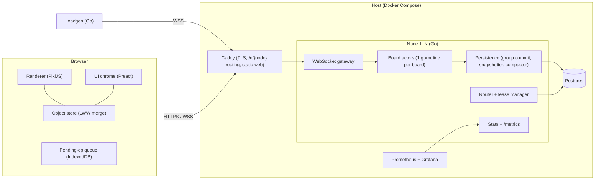
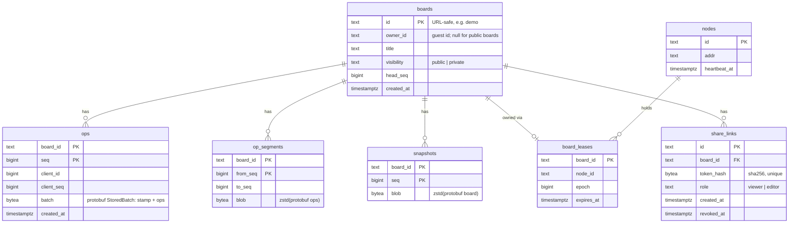
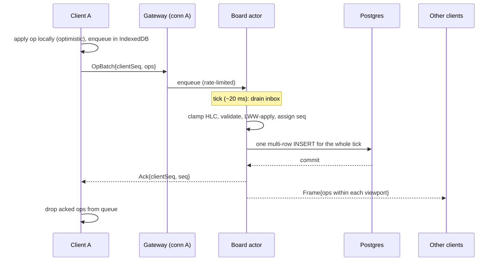
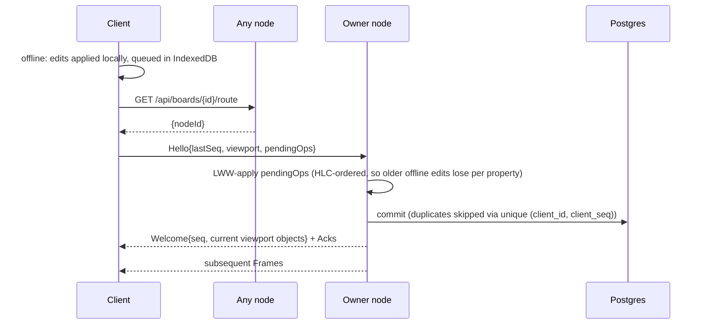
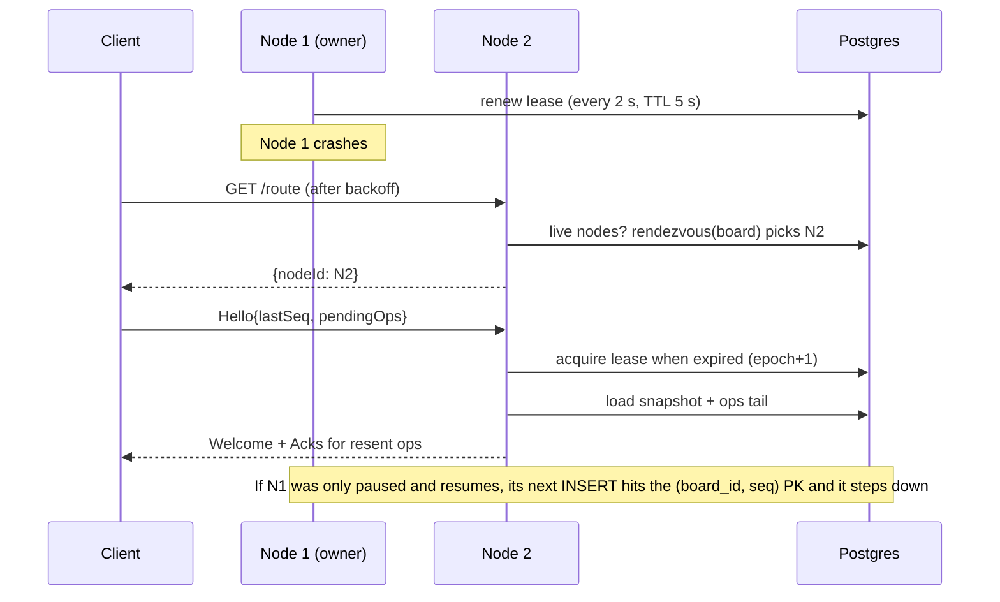

# Architecture

This doc describes the design; every number in it is a design parameter or a target, not a measured result. Decisions and trade-offs are recorded in [decisions/](decisions/).

## 1. Components

| Component | Responsibility |
|---|---|
| Renderer | Draws the objects in the client's cache. Hit-testing. Switches to level-of-detail (LOD) mode when zoomed out. |
| Object store | The client's copy of the objects in its viewport. Applies local ops optimistically and merges remote ops with LWW. |
| Pending-op queue | Ops the server hasn't acknowledged, persisted in IndexedDB so they survive reloads and offline periods. |
| WebSocket gateway | Handshake and auth. One reader and one writer goroutine per connection. Bounded send queues. |
| Router and lease manager | Node heartbeats. Rendezvous placement. Acquiring and renewing board leases. The `/route` API. |
| Board actor | The single writer for one board. Keeps objects and a spatial grid in memory. Assigns `seq`. Runs the tick loop. |
| Persistence | Group commit per tick. Snapshots every 5k ops or 10 minutes. Compacts ops into segments. |
| Stats | Prometheus metrics, plus a public stats stream for the live metrics panel. |
| Loadgen | Simulated editors that speak the real protocol. Records latency histograms. |

## 2. Data model

### Board object
| Field | Type | Notes |
|---|---|---|
| `id` | string | Generated by the client: `{clientId in base 36}:{counter in base 36}`. The server only accepts creates under the sender's own prefix. |
| `type` | enum | rect, ellipse, sticky, text, arrow, freehand. Set once, at create. |
| `deleted` | bool | Deleting sets it to true; restoring sets it back to false. |
| `x, y, w, h` | double | Bounding box in board coordinates. The spatial index uses it. |
| `z` | string | Fractional index. |
| `fill`, `stroke`, `strokeWidth` | uint32 RGBA, float | Style. |
| `text` | string | Text of stickies and text shapes. LWW on the whole string. |
| `points` | bytes | Freehand points, delta-encoded (W3). |
| `from`, `to` | {objectId, anchor} | Arrow bindings (W3). |

Each property is a last-writer-wins register with its own stamp `(wallMs, counter, clientId)`. The schema is `ObjectProps` in [proto/whiteboard/v1/protocol.proto](../proto/whiteboard/v1/protocol.proto).

### Operations
There is one op: `Op{id, props}`, meaning "set every property present in `props`". Create, edit, delete, and restore are all this op:
- **Create:** an op on an unknown id that sets `type`.
- **Delete:** sets `deleted = true`. A concurrent edit to other properties can't bring the object back, and history or undo restores it with a newer `deleted = false`.

A client sends ops in an **OpBatch**. All ops in a batch share one stamp and are applied atomically. A multi-select drag is one batch.

### Postgres schema (v1)

There is no users table: a guest id lives only in its signed token, and `boards.owner_id` holds it. Accounts (GitHub sign-in) are later scope.

Timers and votes are stored as ops in the same log, with their own op types, so replay includes them.

### Wire protocol (Protobuf over binary WebSocket frames)

The schema is [proto/whiteboard/v1/protocol.proto](../proto/whiteboard/v1/protocol.proto). "Since" marks the milestone that adds each message.

| Direction | Message | Purpose | Since |
|---|---|---|---|
| Client → server | `Hello{boardId, clientId, viewport, guestToken, shareToken}` | Join or rejoin a board. A missing viewport means the whole board. The tokens say who is joining (3.9). | W0/W1 (viewport W4, tokens W6) |
| Client → server | `OpBatch{clientSeq, stamp, ops}` | Send edits. | W1 |
| Client → server | `TimePing{t0}` | RTT and clock-offset estimation. | W0 |
| Client → server | `Viewport{x, y, w, h, lod}` | Change the region the client receives. It is ordered with the client's batches. | W4 |
| Client → server | `Cursor{x, y}` | Presence. | W3 |
| Client → server | `HistoryAt{seq}` | Request board state at a point in history. | W5 |
| Server → client | `Welcome{seq, objects, lastClientSeq, serverTime, online, role}` | Snapshot of the objects in the viewport, for (re)joining. `lastClientSeq` tells a reconnecting client which pending batches the server already applied. `role` is viewer, editor or owner. | W1 (role W6) |
| Server → client | `Frame{batches[], acks[], cursors[], objects[], leave[], online, seq}` | Per-tick delivery. It carries: • the ops of other clients' batches on objects this client holds, in seq order • acks for its own batches: the stamp each was applied with, or `rejected` • nearby cursors that moved or left • objects entering its view, in full • ids of objects leaving its view • the online count • the board seq | W1 (cursors W3, the rest W4) |
| Server → client | `TimePong{t0, serverTime}` | Clock-offset reply. | W0 |
| Server → client | `ServerError{code, message}` | Sent before closing; codes that retrying can't fix (`UNSUPPORTED_VERSION`, `BAD_REQUEST`, `CLIENT_ID_IN_USE`, `FORBIDDEN`) stop reconnection. | W0/W1 (`FORBIDDEN` W6) |
| Server → client | `Moved{nodeId}` | Wrong node; the client should re-route. | W8 |

## 3. Data flows

### 3.1 Edit path

- **Encode once:** each op, cursor update and entering object is serialized once per tick. A client's frame is assembled by concatenating the pre-encoded pieces it needs ([internal/board/frame.go](../internal/board/frame.go)). A property test checks the assembled bytes decode to exactly the marshaled message.
- **Parallel fan-out:** frames are independent per client, so with 32 or more clients they are built by a pool of worker goroutines while the actor waits ([internal/board/fanout.go](../internal/board/fanout.go)). Workers only read board state; kicking a slow client happens afterwards, on the actor.
- **Backpressure:** each connection has a bounded send queue (256 messages). A client that overflows it is closed with WebSocket code 1013 ("try again later"). It then reconnects and gets a fresh snapshot, so one slow client never stalls the board. Incoming traffic is throttled differently: a client whose batches fill the board's inbox is blocked on its own socket, not dropped.
- **Commit before broadcast:** each tick, the board appends that tick's batches with one `COPY`, then sends acks and frames. An edit becomes visible to others only after it is durable.
- **Crash-only failure:** if a commit fails, the board kicks every client (close code 1013) and unloads. Uncommitted batches were never acked, so their clients resend them to the reloaded board.
- **Load and snapshots:** a board loads from its latest snapshot plus the log after it. That rebuilds objects, `seq`, each client's last `clientSeq`, and the HLC. Snapshots are written every 5,000 batches (in the background, from a copy), when an idle board unloads, and on shutdown.
- **Tests:** [internal/client/client_test.go](../internal/client/client_test.go) crashes boards repeatedly during randomized editing, and [test/e2e/kill_test.go](../test/e2e/kill_test.go) SIGKILLs the real node mid-edit. Both check that every acked batch is in the log and that all replicas converge.
- **Stamp clamping:** a stamp more than 2 s ahead of server time is replaced with the server's clock. The ack carries the replacement, and the client resyncs, because its local replica holds values under a stamp nobody else has.
- **Duplicates and gaps:** the board tracks the last `clientSeq` per client. A resend of an applied batch is acked again but not reapplied. A gap is rejected.
- **Newest connection wins:** a reconnecting client often arrives before the server notices its previous socket died, since half-open TCP connections can linger for minutes. So a join with an existing client id replaces the old connection. The old one gets `CLIENT_ID_IN_USE` and does not reconnect, so two tabs sharing an id can't keep evicting each other.
- **Convergence tests:** [internal/client/client_test.go](../internal/client/client_test.go) drives real sockets with random edits, drops, and offline periods. [web/src/sync/session.test.ts](../web/src/sync/session.test.ts) property-tests the browser session against a model server.

### 3.2 Viewport interest (spatial filtering)
- **Server index:** the board actor keeps a uniform grid of 512×512-unit cells, mapping each cell to the visible objects in it ([internal/spatial](../internal/spatial)). Updates are O(cells covered), and moves are frequent. Very large boxes go in a separate list that every query checks.
- **Subscriptions:** each client subscribes to its visible area plus a 50% margin per side. It resubscribes when the view leaves that area, when LOD turns on or off, or when zooming in has left most of the subscription unused.
- **The server decides what each client holds:** the visible objects whose box intersects its viewport. For each op, the server compares the object's box before and after against each client's viewport:
  - **In view before and after:** the client gets the op (a delta). The sender is skipped, since it applied its own op already.
  - **Enters the view:** the client gets the full object in `Frame.objects`. This includes the sender, for example when it undoes a delete.
  - **Leaves the view** (or is deleted): the object's id goes in `Frame.leave`.
- **Clients never evict on their own.** They apply deltas only to objects they hold. An early design had clients evict by their own copy of an object's position, and randomized tests showed that races: a concurrent edit could leave the server believing a client still held an object it had dropped.
- **Pending edits are kept:** a left object that has unacknowledged local edits stays on the client until they are acked. The server never echoes a client's own edits, so dropping the object would lose them. The randomized tests found this case too.
- **Viewport change:** the server first judges the tick's earlier ops against the old view, then queues enters for objects in the new view only and leaves for objects in the old view only. Without the first step, ops that happened under the old view would be judged by the new one; the randomized tests found that as well.
- **Arrows:** interest uses each object's stored box. When a shape moves or is resized, the client updates the stored geometry of arrows attached to it in the same batch, so an arrow's stored box stays where it is drawn.
- **LOD mode:** used below 20% zoom. The server sends only the box properties (type, deleted, x, y, w, h, z, fill), and clients draw every object as one particle in a Pixi `ParticleContainer`, uploaded to the GPU only when something changed.
- **Tests:** [internal/client/client_test.go](../internal/client/client_test.go) runs randomized convergence with random, changing viewports, crashes and drops. Each client must end up holding exactly the server's visible objects in its viewport.

### 3.3 Presence (live cursors)
- **Ephemeral:** cursors are never persisted or sequenced.
- **Client side:** each client sends at most 15 Hz. The throttle always sends the latest position last.
- **Gateway:** drops cursor messages that arrive less than 40 ms after the previous one from the same connection.
- **Board:** cursor updates skip the actor's inbox. Connection goroutines write the latest position per client into a small mutex-guarded map, so presence traffic can never delay edits. Moves from clients no longer on the board are dropped, so a late cursor message can't leave a ghost behind.
- **Every 3rd tick (about 16 Hz):** each client gets the **30 nearest** cursors in its viewport, found through a grid of cursor positions. It receives positions that moved or newly entered its selection, and `gone` for ones that left. `Frame.online` carries the total count.
- **Why not every tick:** a profile under 200 editors showed presence on every tick taking about 30% of CPU, all on the board actor ([local pre-check](../benchmarks/results/2026-09-27-local-w4.md)).

### 3.4 Reconnect and offline

- **Clock clamp:** HLC values ahead of server time by more than the allowed skew are clamped, so an offline client with a wrong clock can't overwrite newer work.
- **Offline queue (W6):** unacknowledged batches are written to IndexedDB (`web/src/sync/persist.ts`), so they survive a reload, a crash or a closed tab. Writes are grouped into one transaction per 100 ms and committed at once when the page is hidden.
  - **Client id per tab:** each tab works under its own client id per board (the server allows one live connection per id). The id is held with a Web Lock while the tab lives. A tab that opens later takes over an unheld id with its saved batches and counters, and resends; the server skips batches it already applied. Two tabs never share an id.
  - **Counters:** the next client seq and object number are saved too. A reused id must never repeat a client seq the server has seen, or the server would ack the new batch as a duplicate without applying it; the `Welcome`'s `lastClientSeq` is a second guard.
  - **No hard cap:** dropping edits would lose work, so the queue is not cut. Past 5,000 unsynced batches the status turns into a warning. A long offline drag queues a batch per pointer event; merging them is later work.
  - Without IndexedDB or Web Locks (plain-HTTP origins other than localhost), edits live in memory only, as before.
  - Tested by the randomized session test, which reloads clients from their saved state mid-run, and by a browser test that reloads while the server is down.

### 3.5 History replay and point-in-time restore
- **Compaction:** after each snapshot, log entries up to it move into `op_segments`: zstd-compressed runs of up to 10,000 entries. Each segment is written, and its rows deleted, in one transaction, so every seq is stored exactly once. Loading a board never reads segments; history does. Measured: 1M edits take 31 MB with full history, against 172 MB as one row per edit ([results](../benchmarks/results/2026-09-28-storage.md)).
- **State at `seq = s`:** start from the nearest snapshot or cached keyframe at or before `s`, then replay the log (segments and live rows) up to `s`.
  - This runs on the requesting connection's history goroutine, never the board actor, so scrubbing does not delay live editing.
  - A state 1,000 or more batches from its base is cached as a keyframe (LRU of 8).
  - History only shows committed batches.
- **Replay slider:** the client sends `HistoryRequest{seq}`, debounced, and the gateway keeps only the newest pending request per connection. `History` holds the objects in the client's viewport, and the canvas shows them read-only while live edits keep syncing underneath. (A play button is later scope.)
- **Restore to `s`:** the board actor diffs the present against the state at `s` and appends the difference as one batch from the server (client id 0), which every client receives. History stays append-only, and a restore can be undone by restoring the version before it.
- **Unset fields:** a register cannot be unset. Text written since `s` is cleared to `""`; other fields first set after `s` keep their values (the UI sets them at create).

### 3.6 Placement and failover

- **As built (W8):** see ADR-0005's implementation notes. In short:
  - Every node is a cluster member, even when there is only one. Compose runs two, `node-1` and `node-2`.
  - A board is served only under a lease. Leases are renewed every 2 s for 5 s, all of a node's boards in one statement, and a board stops on its own once its lease could have run out.
  - Clients find the owner through `/api/boards/{id}/route` and `/n/{node}/ws`, and follow `Moved`.
  - Cross-node actions, such as revoking a link, go through Postgres `NOTIFY`.
  - The live stats panel shows the node the browser is connected to.
  - The `Hello` carries no pending ops: after a reconnect the client resends them as ordinary batches, and the server skips those it already has.

### 3.7 Board-wide objects and synchronized timers
- **Board-wide objects (W7):** board state that is not a shape lives in objects with reserved ids starting with `_`: the timer (`_timer`), the vote (`_vote`) and one ballot per client (`_ballot:<client id>`). They are ordinary objects in the op log, so they get last-writer-wins merging, persistence, history and offline queuing for free.
  - **Delivery:** their interest box is "everywhere", so every client holds them whatever its viewport, and they are never cut down for zoomed-out (LOD) clients. They are kept out of the spatial grid and are not drawn on the canvas.
  - **Validation:** each has its own type and a fixed set of fields it may set; shapes may not set those fields. A client may write only its own ballot.
- **Timer state:** `ends_at_ms` (server time when it runs out; 0 when not running) and `remaining_ms` (the full duration while running, what is left while paused). Every control writes both fields in one op, so concurrent clicks resolve to one of them, whole. Any editor can start, pause, resume, add a minute or reset.
- **Clock offset:** the client pings every 2 s and uses the lowest-RTT sample of the last 8: `offset = tServer + rtt/2 − t_recv`. Display is `ends_at_ms − (Date.now() + offset)`, redrawn every 200 ms, so a wrong local clock does not matter. A browser test runs one browser with its clock an hour fast and checks both show the same time to within a second.
- **Measured quality:** timer skew under load is measured in BENCHMARKS.md (not yet run).

### 3.8 Voting
Dot voting, built in W7 on board-wide objects (3.7):
- **Session:** the `_vote` object holds the session id (in `text`), the dots each person gets (`votes_per_user`, 1–20) and `closed`. Any editor can start a session or end it.
- **Casting:** each client writes only its own ballot, `_ballot:<client id>`: the session id and the voted-for object ids, one entry per dot. A whole ballot is one value, so placing or taking back a dot is one write with no conflicts between voters. The server checks a ballot against the open session: the right session id, at most `votes_per_user` dots, well-formed shape ids (not that the shapes exist; results skip missing ones). Ballots from earlier sessions are ignored, so a new session starts from zero.
- **Results:** ending the session shows the totals to everyone, as a ranked list and as counts on the shapes; deleted shapes drop out. While it is open, the UI shows each person only their own dots. That is not secret: every client receives every ballot. Hiding votes from clients would need per-client filtering on the server.
- **Limits:** a person with two tabs has two client ids, so two ballots. Votes are per client, not per person.

### 3.9 Auth, permissions, abuse
Built in W6 (`internal/access`, `internal/ratelimit`).
- **Guest identity:** on first visit the client calls `POST /api/guest` and keeps the token in localStorage. The token is `<guestId>.<HMAC-SHA256(guestId)>`, keyed by the `SECRET` setting, so the server stores nothing per guest. No signup. A forged or stale token just means anonymous.
- **Visibility:**
  - Visiting an unknown board id creates a **public** board: anyone with the id can edit it (the demo board works this way).
  - A board made with "New private board" (`POST /api/boards`) is **private**: only its owner and holders of a share link can open it. Anyone else gets `FORBIDDEN` and the client stops reconnecting.
- **Roles:** owner, editor, or viewer, decided once per connection and sent in the `Welcome`.
  - Owner: the guest who created the board. Only the owner can manage links.
  - Editor or viewer: granted by a **share link**.
  - The server enforces the role: a viewer's `OpBatch` or `Restore` is answered with `FORBIDDEN` and the socket is closed. The client also disables editing.
- **Share links:**
  - Format: `/b/{boardId}#k={token}`. The token is in the URL fragment, so it never appears in server logs or Referer headers.
  - The server stores only a SHA-256 hash of the token, and the owner sees the link once, when it is created.
  - Revoking a link (`DELETE /api/boards/{id}/links/{link}`) also disconnects everyone connected through it, at once: the board actor knows which link each connection came in on.
- **HTTP API:** `POST /api/guest`; `GET|POST /api/boards` (my boards, new private board); `GET|POST /api/boards/{id}/links`; `DELETE /api/boards/{id}/links/{link}`. All but the first take `Authorization: Bearer <guest token>`.
- **Limits:**
  - Per connection, token buckets with two seconds of burst: 240 batches/s, 2,000 ops/s, 1 MiB/s. A client over them is **slowed down, not disconnected**: the gateway stops reading its socket until tokens refill, so TCP pushes back on the sender. The defaults leave room for a fast pointer drag, which sends a batch per pointer event. Cursor updates over ~25 Hz are dropped (W3). Delays are counted in `ws_throttled_total`.
  - Per message: 256 KiB, and 500 ops per batch.
  - Per IP: 64 open WebSockets (`MAX_CONNS_PER_IP`; 0 turns it off for load tests from one machine), and 30 new private boards an hour with a burst of 10. Refusals return HTTP 429 and are counted in `limit_rejections_total`. Behind Caddy the client IP is the last `X-Forwarded-For` entry (`TRUST_PROXY=true`), which Caddy appends itself.
  - Per board: 200k objects, deleted ones included (they are kept as tombstones). A batch that would create more is rejected; edits to existing objects still work.
  - Not limited yet: public boards created by visiting new ids. Each costs one row until it has content.
- **Demo board:** resets nightly from a seed snapshot. Vandalism can also be reverted with restore.

## 3.10 Browser client
- **Renderer:** PixiJS (WebGL), with one view per object in `(z, id)` order. Frames render **on demand**: a `FrameScheduler` renders once in the next animation frame after the board, camera or overlay changes. An idle board draws nothing. Measured locally under headless software rendering, switching to this took the editor browser tests from 2.0 min to 21 s.
- **Hit testing:** done in board coordinates by the client, not Pixi's event system, with per-shape tests (ellipse equation, distance to polyline). It is O(n) per pointer event for now; W4 adds a spatial grid.
- **Arrows:** an attached end follows its target and is clipped to the target's outline (rectangle or ellipse). Moving an arrow keeps an attachment only if the target moves with it.
- **Text:** edited in place in a textarea laid over the canvas. Text objects size their height to their content.
- **Undo:** gestures (a whole drag or resize) undo as one step. Undo writes the previous values back with a fresh stamp (ADR-0001).

## 4. Observability
- **Prometheus metrics** (`internal/metrics`, served on `/metrics`, which Caddy does not expose):
  - Connections and traffic: `ws_connections`, `ws_messages_in_total{type}`, `fanout_bytes_total`, `clients_kicked_total{reason}`.
  - Limits: `ws_throttled_total{limit}`, `limit_rejections_total{limit}`.
  - Boards and edits: `boards_active`, `batches_applied_total`, `batches_rejected_total`, `stamps_clamped_total`, `board_restores_total`, `board_failures_total{stage}`.
  - Timing: `board_tick_duration_seconds`, `board_commit_duration_seconds`, `board_load_duration_seconds`, `board_snapshot_duration_seconds`, and `sync_server_latency_seconds`, from a batch arriving until it is committed and its frames are queued to the other clients.
  - Snapshots: `board_snapshots_written_total`, `board_snapshot_failures_total`.
- **Live stats panel (W7):** `GET /api/stats/stream` sends a server-sent event once a second (`GET /api/stats` gives one snapshot). It reports, for the node the browser is on: open connections, boards in memory, edits per second, and p50/p99 of server sync time (as in `sync_server_latency_seconds`). The rate and percentiles are over the last 10 complete seconds, kept in per-second HDR histograms (`metrics.Live`). The panel adds the browser's own median round trip over its last 50 edits, from sending an edit to its ack, timed from when it was actually sent. Each number says what it measures; none of them is a benchmark result. Clients do not report latency to the server.
- **Logs:** structured JSON via `slog`.
- **Grafana:** used in production.

## 5. Known limits (v1)
- Concurrent typing in the same text object resolves to one winner.
- Postgres is a single point of failure.
- Each board is served by one node.
- One hosting region.
